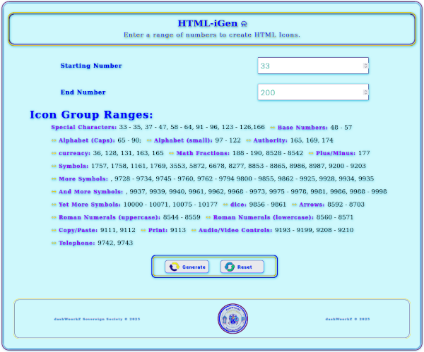

# HTMLiGen
HTML Icon Generator

    I started to make this program after watching Adam Koury's "Flat Icons HTML Code Symbols Discovery JAvascript"
    you can watch it here: https://www.youtube.com/watch?v=5G-XFiAHtpU, not sure he is still making videos, this one
    is 8 years old, so i want to thank Adam Koury for the inspiration to write this.

    There are a few quirks i haven't ironed out yet, the files responsiveness, i had it working great, then the time 
    i go to test it, the results are not good, worse part about coding for the web, making the file responsive, 
    if you notice nothing happens after trying to generate some icons, try starting from a lower number, one of the 
    most recurring quirks is trying to go from say 75 to 116, because you crossed into another hundred level or something, 
    it won't generate, just try another number, also my errors don't seem to be activating alerts, also, i haven't been 
    able to clear the icons being displayed when i use the clear button, i tried a n Event Listener, but it didn't seem
    to take effect,not sure of any other quirks, there probably are, but iwill continue to work on it, and add new features.
    
    I will be considering this program a work in progress, i have lots of ideas for it, just not sure i have the time
    to implement them all, enjoy this program and do with it as you will, spread the good news, take care and God Bless.
    Lord: Dash: LA Londe.
    dashWoorkZ Sovereign Society
    Managing Director
    dash@dashwoorkz.ca
    
    
    MIT License

Copyright © 2025 dashWoorkZ Sovereign Society

Permission is hereby granted, free of charge, to any person obtaining a copy of this software and associated documentation files (the "Software"), to deal in the Software without restriction, including without limitation the rights to use, copy, modify, merge, publish, distribute, sublicense, and/or sell copies of the Software, and to permit persons to whom the Software is furnished to do so, subject to the following conditions:

The above copyright notice and this permission notice shall be included in all copies or substantial portions of the Software.

THE SOFTWARE IS PROVIDED "AS IS", WITHOUT WARRANTY OF ANY KIND, EXPRESS OR IMPLIED, INCLUDING BUT NOT LIMITED TO THE WARRANTIES OF MERCHANTABILITY, FITNESS FOR A PARTICULAR PURPOSE AND NONINFRINGEMENT. IN NO EVENT SHALL THE AUTHORS OR COPYRIGHT HOLDERS BE LIABLE FOR ANY CLAIM, DAMAGES OR OTHER LIABILITY, WHETHER IN AN ACTION OF CONTRACT, TORT OR OTHERWISE, ARISING FROM, OUT OF OR IN CONNECTION WITH THE SOFTWARE OR THE USE OR OTHER DEALINGS IN THE SOFTWARE.

Visit http://everythingDash.creator-spring.com to purchase merchandise and support this project.
Visit http://dashwoorkz.ca to learn more about what we do and what other projects we have on the go.
